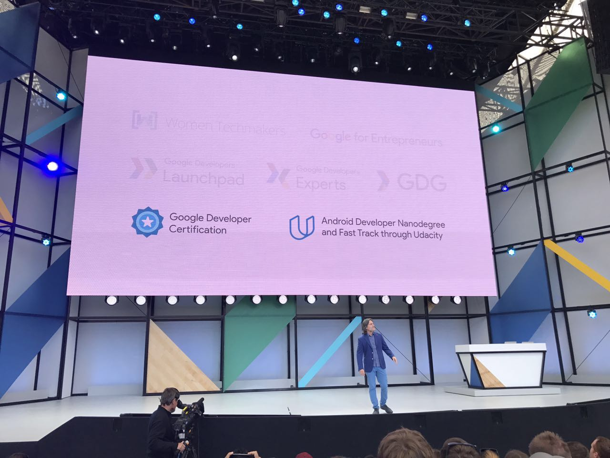
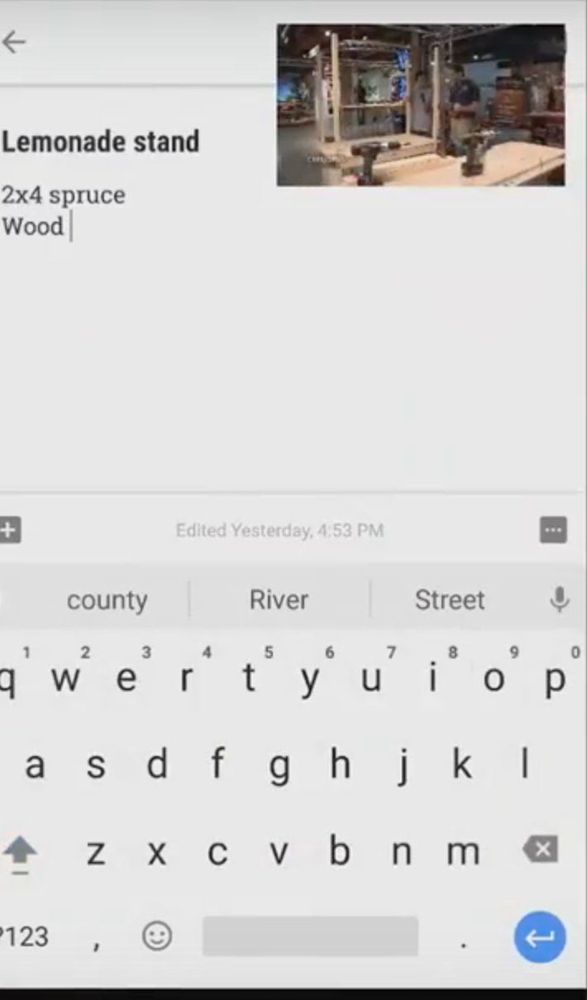
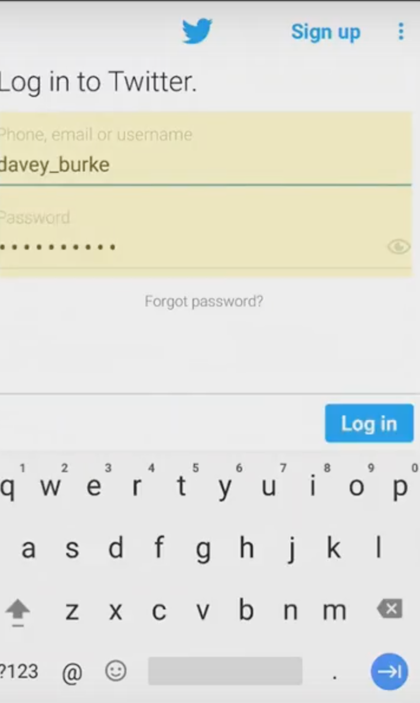
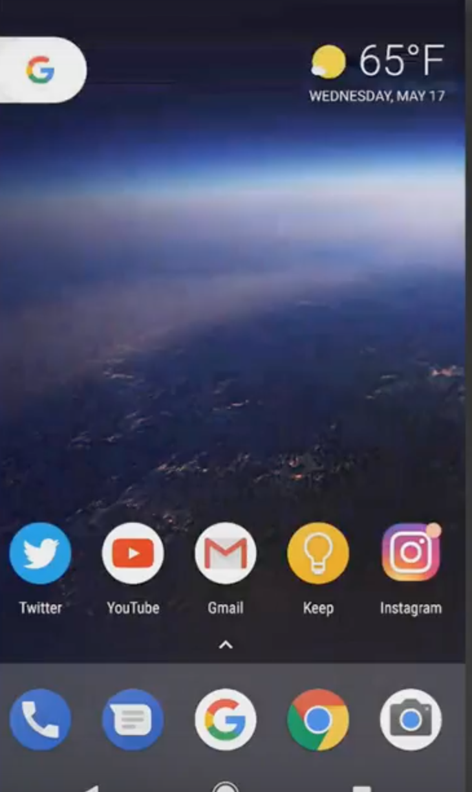
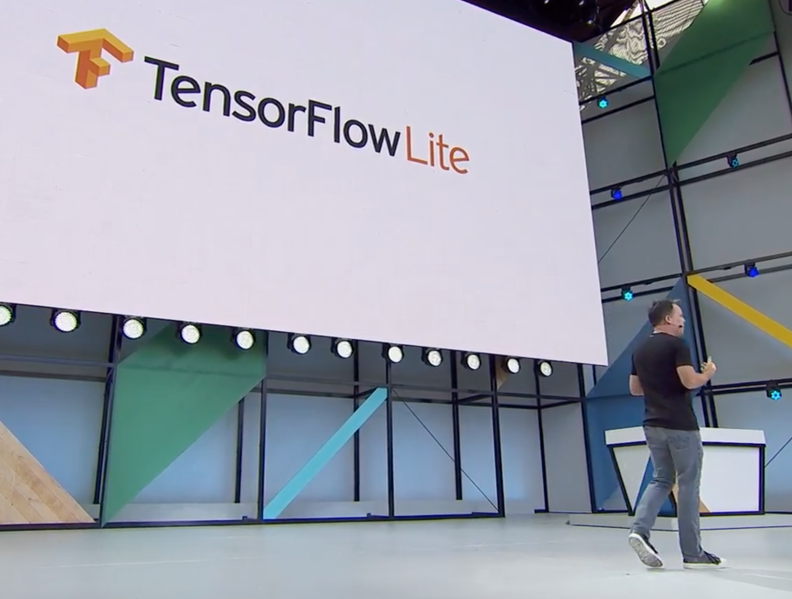
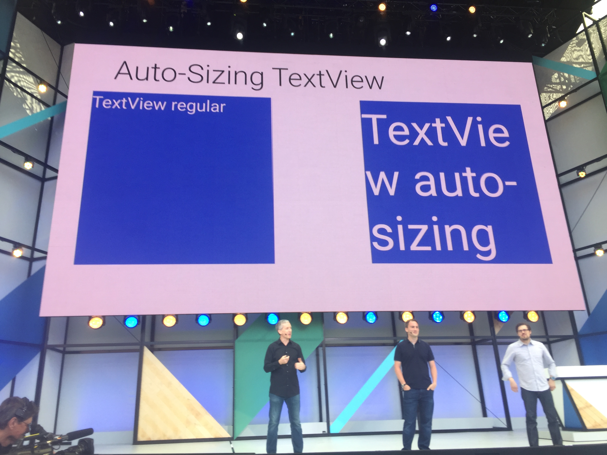
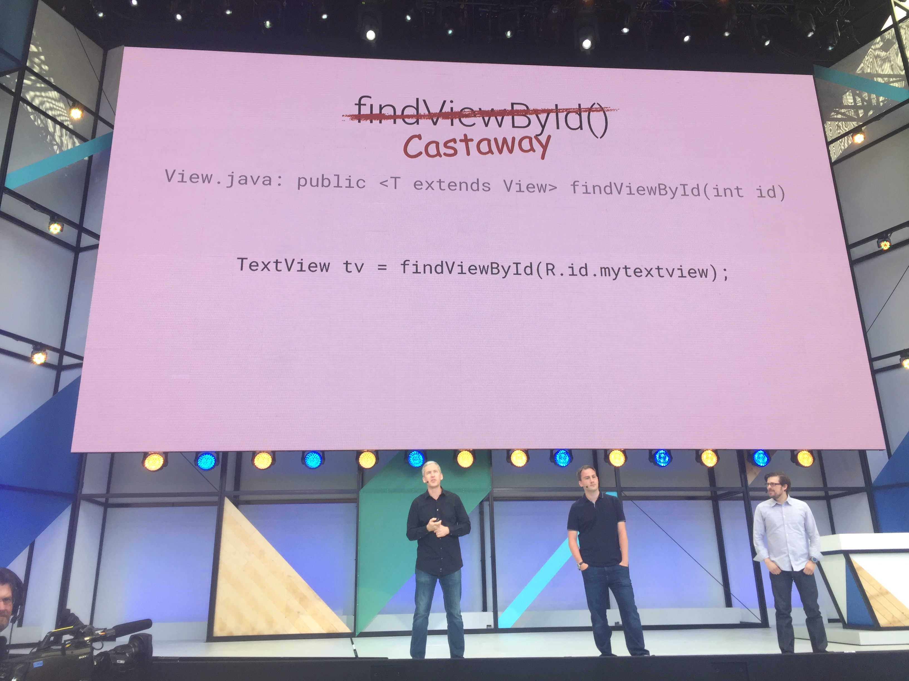
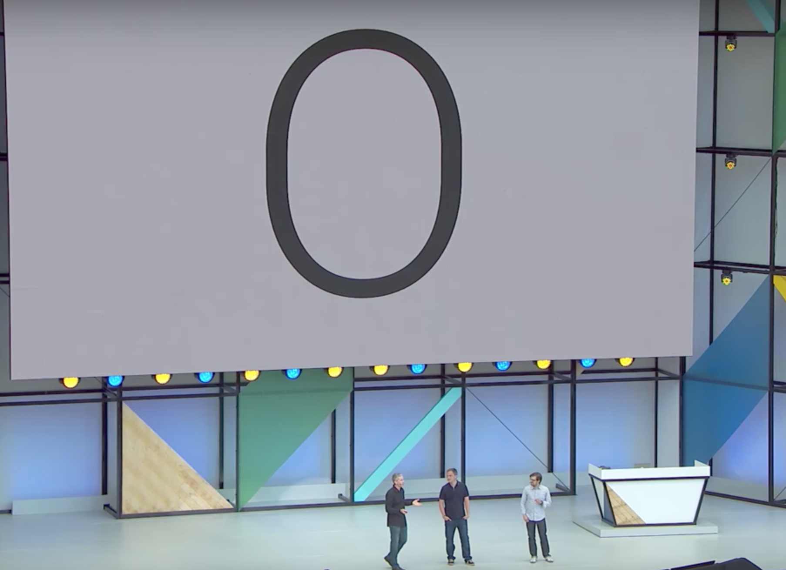
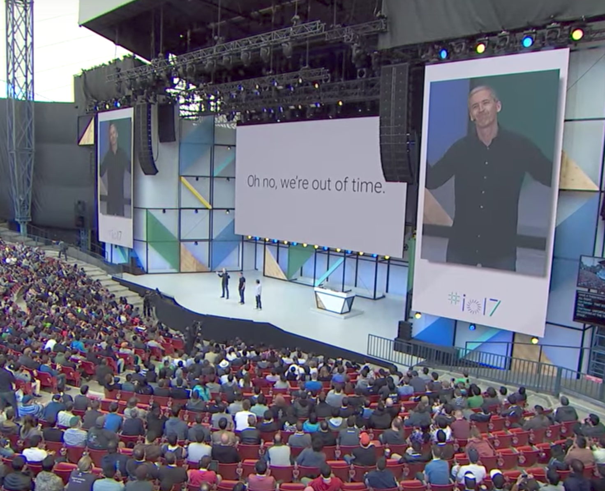

# What's new in Android? #WNIA

没。。。真没啥。

其实我是一个 Android 脑残粉来的，不但把Google 和 Udacity合作开发的 Android 开发纳米学位全部搞定，还把针对纳米学位的 Google Android 开发者证书也一起搞定了！Keynote里面放出我的证书的时候，我还站起来摇摆了一番！



但这次，真的啥都没有。好吧，为了证明真的没啥，我就来说说有啥吧。

### Picture in Piture
用中文说，就是**画中画**吧。我记得当年iOS在被吐槽是单任务操作系统的时候，Android沾沾自喜说自己当然是多任务。但是iPad现在都支持缩小视频到角落多少年了，怎么Android才开始刚刚支持这功能？不对啊，我记得很多年前我妈用的LG手机也支持呀？



###Smart Text Selection
据说用了向前传播神经网络实现了自动选择店名，地址，电话和email，我想说，iphone上地址和电话似乎很早就可以高亮了？ 感觉这事情也用不到神经网络吧？ 是不是杀鸡用牛刀了呀。这个功能么，我也没有很激动。摊手


### Autofill with Google
Android O开放了Autofill的接口, 可以在app里面自动填 账号密码？ what？ 自动填账号密码你也拿出来demo？



### Notification Dots
可以在app图标上放一个原点，来提示用户这个app需要关注。这个。。。大家的强迫症都来自微信朋友圈的圆点吧？图标上的数字我已经不记得哪天就有了。。。再次摊手。。



好吧，大概真的是没什么了。知不知道为什么上面的图都是视频截图，都没有现场照片？ 因为太无聊了，好困啊。。。

不过还是有点歉意的，想想Android O针对开发者总应该有点东西吧，结果也是很有限啊。。。

###Tensorflow Lite
一个针对Android的Tensorflow版本，感觉有点鸡肋。好好的我直接在云端或者在我的本地训练模型不就好了，为什么要跑去手机上呢？ 就算Tensorflow Lite性能优化做到极致，在手机上跑训练也是耗电大户啊。 如果光光跑一点 Inference的话，感觉也够呛。这个还没正式推出，保留好奇心吧，总感觉有点鸡肋。



### Auto-Sizeing Textview
文本框可以自动根据自己的大小来缩放里面的文字了。Emm, 这貌似全场高潮。我确实是蛮开心的，但这真的要在i/o上讲嘛？



### findViewById 不用强制类型转换了
以前大家都知道 findViewById 返回的是 View，然后我们总是要把他强制转化为它的子类。



老的方法

```
TextView tv = （TextView）findViewById(R.id.mytextview); 
```

新的方法

```
TextView tv = findViewById(R.id.mytextview); 
```

好吧，这其实也蛮不错的，但。。。真的要在IO上讲吗？

#Kotlin
就像ios开发搞出来一个swift一样，现在android开发又搞出来一个Kotlin，demo演示了1行Kotlin 代码代替89行java代码，但我好像还是激动不起来。又要去学新东西了 T_T


说完以上所有，正以为他们要真开始说O了呢！



结果呢



# Oh, we are running out of time!
好吧，我去听下一个session了！
