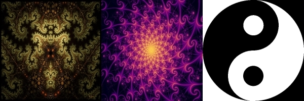
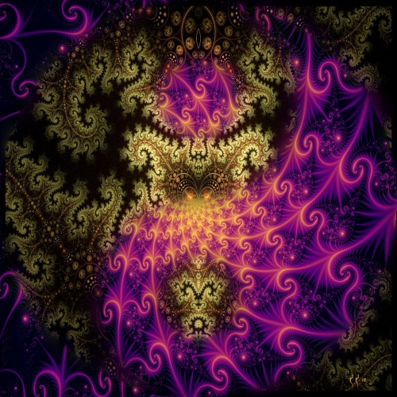
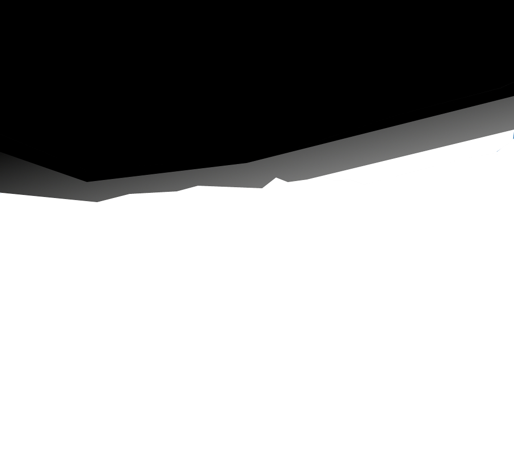
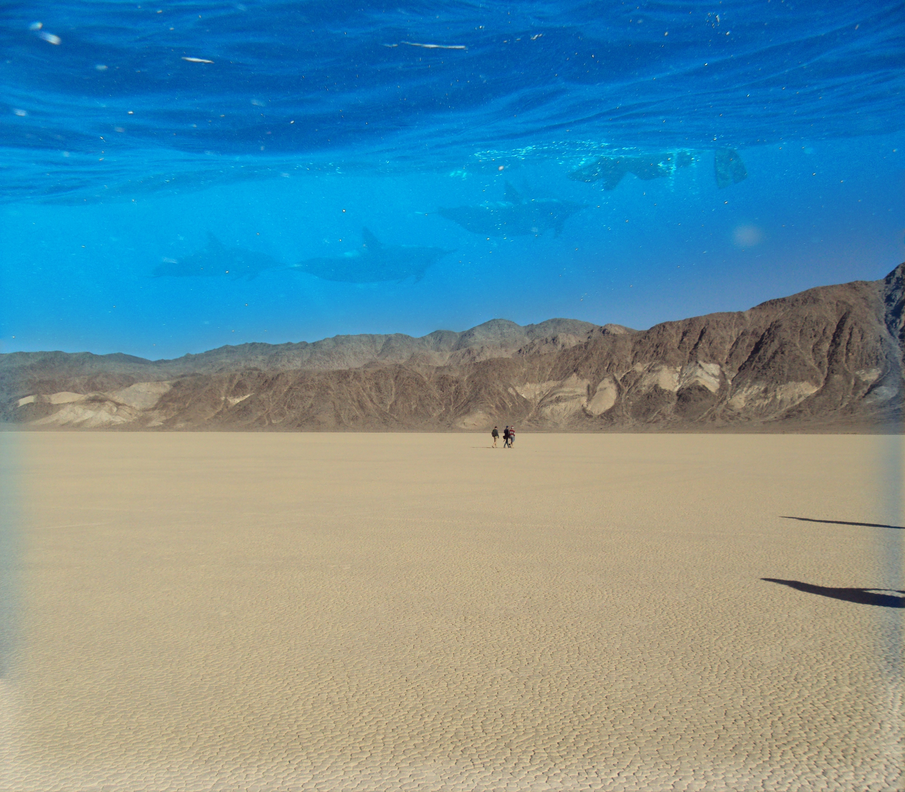
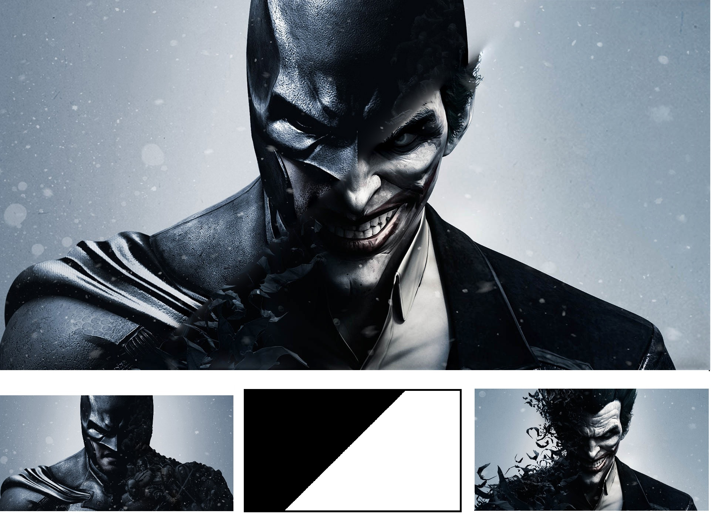
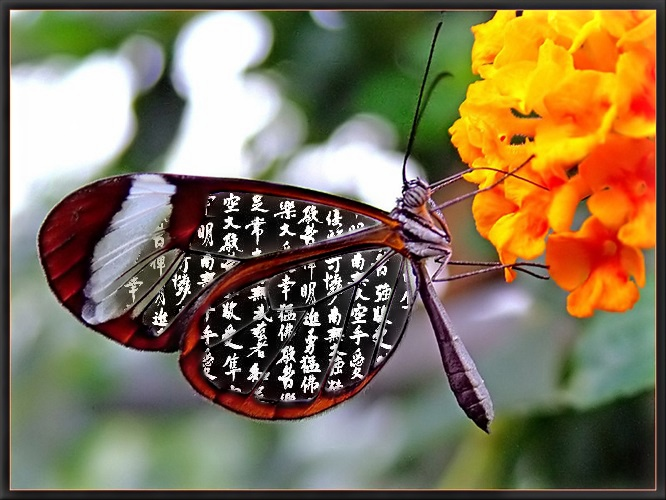
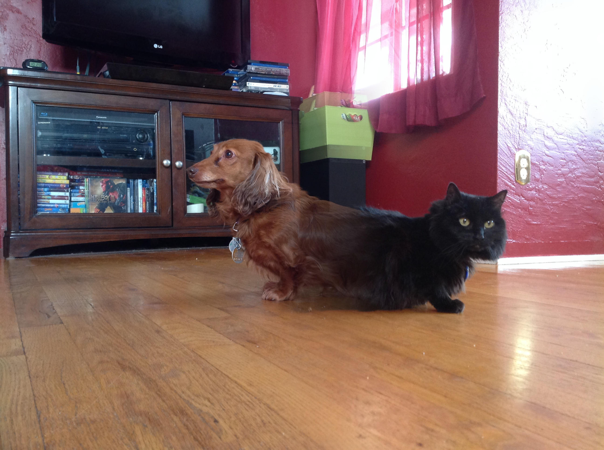

写一点程序来折腾折腾图片总是有趣的事情，至少可以做完了以后发给朋友炫耀一番。 不过大多数时候得到的回应都是，你用什么p的？ 呵呵，我是写程序写的！你才p图，你们全家都p图！#莫名其妙的优越感

最有趣的是当时在读一篇讲 [image blending 的论文](https://s3.amazonaws.com/content.udacity-data.com/courses/ud810/readings/Burt-Adelson1983Laplacian-Pyramid.pdf)。还是蛮说白了就是先把两个图片的 Guassian Pyramid 算出来，然后再出来 Gaussian Pyraimd算出来，然后在每一次把他们 alpha blend 在一起，再全部拼起来。我知道这么说没人听得到，废话别多说，show me the code

####Reduce
采样图片（4个像素点取1个）

```
convolve the image with given kernel 
small = convolveResult[::2, ::2] 
return small
```

####Expand
扩展图片（1个像素点扩4个）

```
initialize big as double size on both dimension. 
big[::2, ::2] = image
convolveResult = convolve big with given kernel
return convolveResult *4
```

####gaussPyramid:
创建gaussian Pyramid，其实就是一层层采样

```
set current to input image 
loop until depth reaches
    reduce the current
    append reduce result to pyramid 
    set current to reduce result
return pyramid
```

####Laplacian Pyramid:
创建Laplacian Pyramid，其实就是记录每一层采样中流逝的信号，以后还能加回来

```
for every level of input pyramid p
    compute p[currentLevel] - expand(p[nextLevel])
    append result to pyramid
return pyramid
```

####blend
把每一层通过alpha blend，合起来，组成新的pyramid

```
for every level
    get black, white and mask of current level
    computer white*mask + black * (1-mask) 
    set the result as the level of return pyramid
return pyramid
```

####collapse
把整个pyramid还原成图片，大功告成

```
current = last level image
loop from the last level to the second level
    expand(current)
    current = expand result + upper level image 
return current
```

### 来看看成品吧

左边右边两张图，加上一张黑白的mask


黑代表选左边，白代表选右边，接缝处无缝连接，最后合成一张图。


再来一个例子，沙漠和海底


合成一张海底沙漠


下面直接放成品了







不过你觉不觉得有趣，我反正觉得是蛮有趣的，哇哈哈。