#Magenta: 艺术大师还是艺术工具？

在深度学习越来越火的今天，人们渐渐得看到很多机器产生的艺术，并且警觉了起来，如果艺术这块领域也被机器占领，那么人类还剩下什么？确实现在深度学习已经渐渐可以吟诗作画，可以模仿大师的风格，虽然目前来说水平还都不怎么样，但谁都不敢小看技术发展的速度，毕竟从0到1是最难的，从1到2只是时间问题。我们现在恰好就在发展的时间段上。

Google Brain团队目前正在研究一个项目：Magenta，用深度学习的方法来推进音乐和画作。很多人听到这个项目第一反应就是，哦，用机器来生成音乐和画作，我们人类可以到一边去了。但其实并非如此，这个项目想要建立新时代的艺术工具，帮助音乐家和画作做出更好的作品。

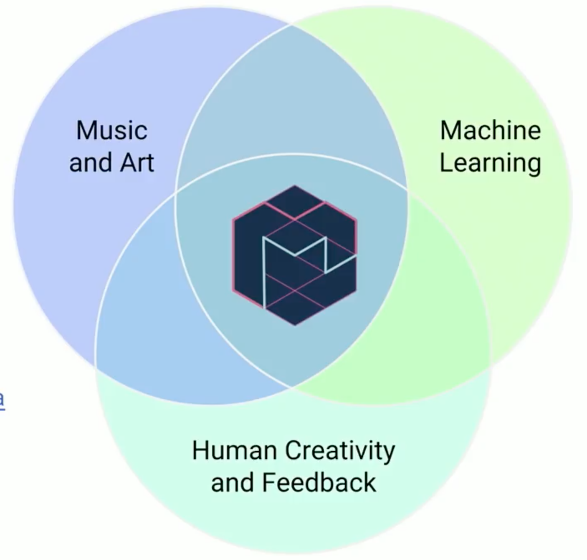

### 艺术的发展总是伴随着音乐

音乐和绘画在很久很久以前不插电的那个年代就有了，音乐是人类灵魂的一部分，无论是敲打还是歌唱都是人类与身俱来的本领，在山洞里那一块石头刻画也是我们祖先智慧的证明。但到了今天，我们有了吉他，有了电吉他，有了音响。有了照相机，年轻人开始在ip ad上，在绘画版上画画，新时代的工具造就了新时代的艺术潮流，老一辈可能完全不能接受，但不可否认科技的发展推动了艺术的发展。

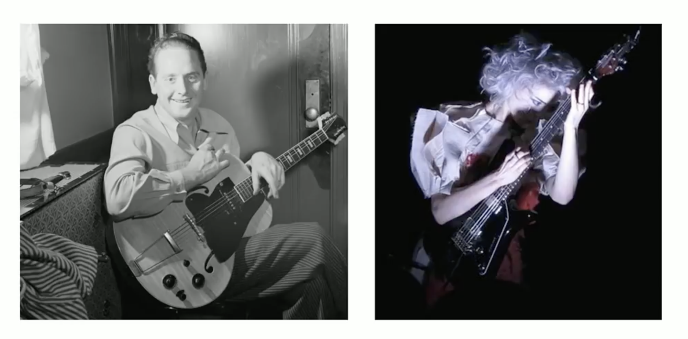

所以Magenta的目标并不是他自己产生什么艺术作品，而是在五年后有人利用Magenta这个新时代的工具创造了新时代的艺术。

### 深度学习是什么？
深度学习其实就是一组很多层的计算单元组合在一起，然后能够从图片或者序列数据中提取到一些我们感兴趣的特征。例如下图我们要识别一张图片中是猫是狗？

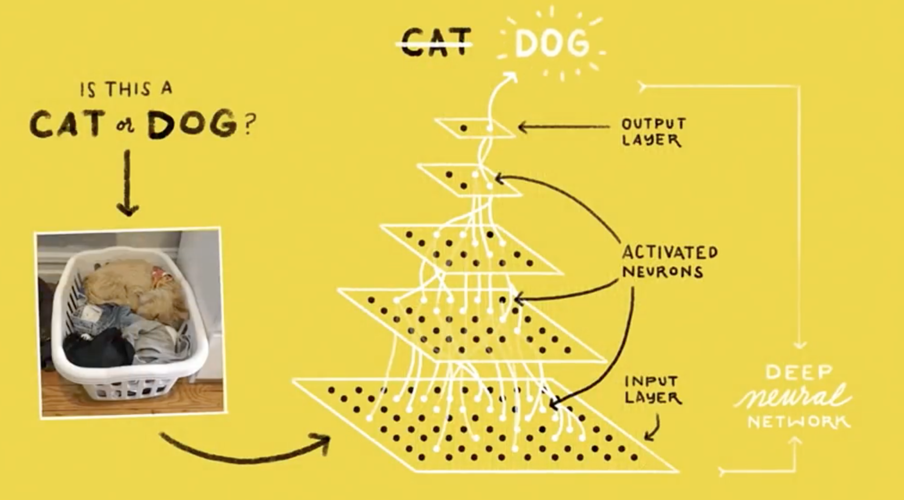
一个经过训练的深度神经网络可以轻松完成这个任务。他首先在底层提取出线条，弧度等基本元素，然后在中间层提取出一些基本的图案，例如圆形，直角，条纹等等。然后在最上层提取出一些图像的高层元素，例如眼睛，耳朵，鼻子等等。最后根据这些元素，来做出正确的猫狗分类。

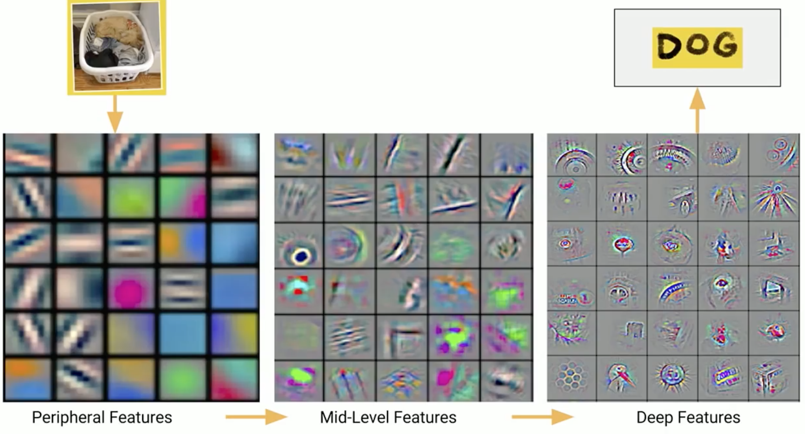

其实神经网络并不是一个特别新的模型。早在1980年就已经有人提出，只是在那个时候神经网络的表现并不如其他模型好。但是当计算能力和数据都有了质的飞跃，擅长扩展的神经网络模型在今天已经超过了其他模型成为表现最好的模型之一

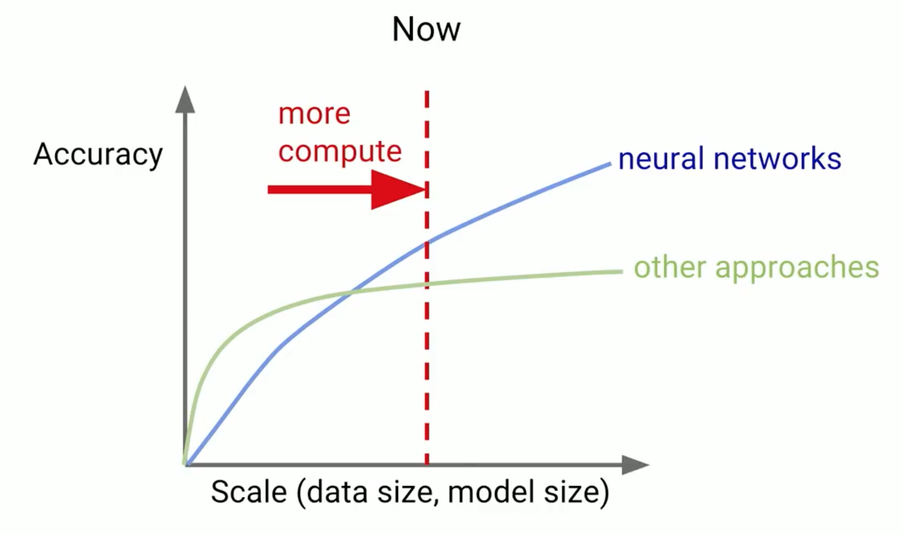

### 项目解析: Sketch-RNN
这篇文章会提到Sketch-Rnn的两个项目，首先第一个叫做 Sketch-RNN，让电脑帮助“灵魂画手”画画。哈哈。其实就是我只要先画几笔，整个程序就可以把剩余的画给画出来。

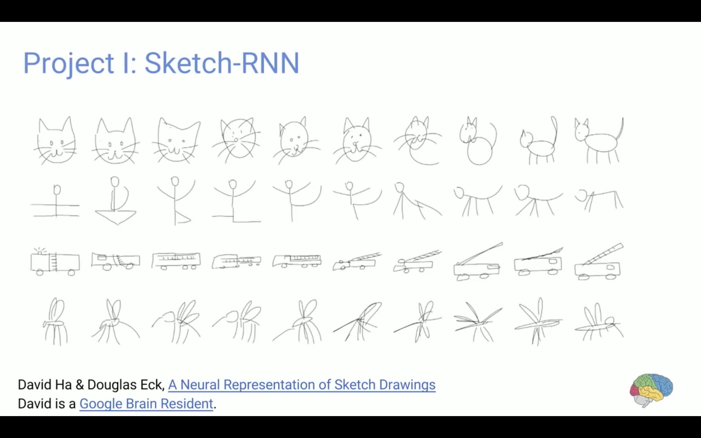

整个项目的高层面其实就是一个Autoencoder。即一个编码器把输入序列变成一个中间表达z，这个中间表达z要比输入数据占用更小的空间，也就是说编码器必须学习到一些归纳或者特征提取的方法来用更小的中间状态z来表达输入数据。接着一个解码器把中间状态z通过另一种方式解码成我们想要的输出。通过不断的训练，我们就能够得到不错的编码和解码器从而能够讲输入的一个个笔画变成一幅完成的画。

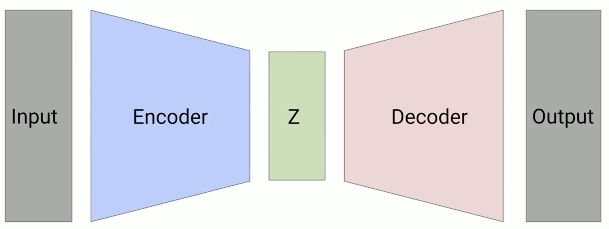

我们可以这个图切开一个个说

#### 输入
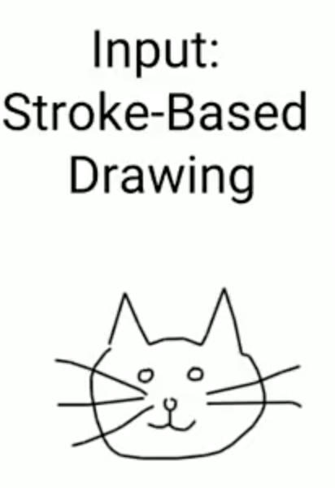

输入就是一个个画图中的笔画，而且这里是一个笔画的序列。无论是在训练还是预测环节，笔画的序列都是至关重要的信息。

#### 编码器
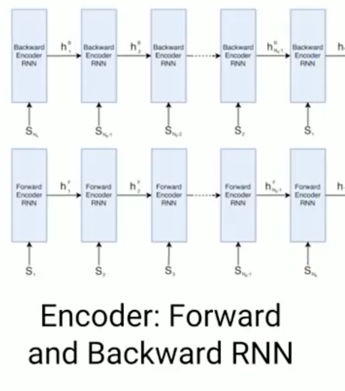

编码器用了双向LSTM网络，把输入序列中每一个笔画正序倒序进行编码，并最终得到一个中间状态，存储了输入序列中的每个笔画和整个序列的顺序。有了这些编码后的信息，之后的解码器就可以解码出一个序列来执行剩余的笔画。

#### 中间状态
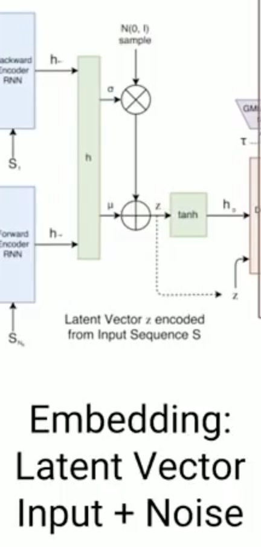

双向LSTM网络的状态合并以后输入给中间状态，同时为了保证在解码的过程不会太依赖中间状态，我们也会增加一些噪音，就好像在图片训练的过程中我们有dropout来帮助增强网络的鲁棒性。

#### 解码器
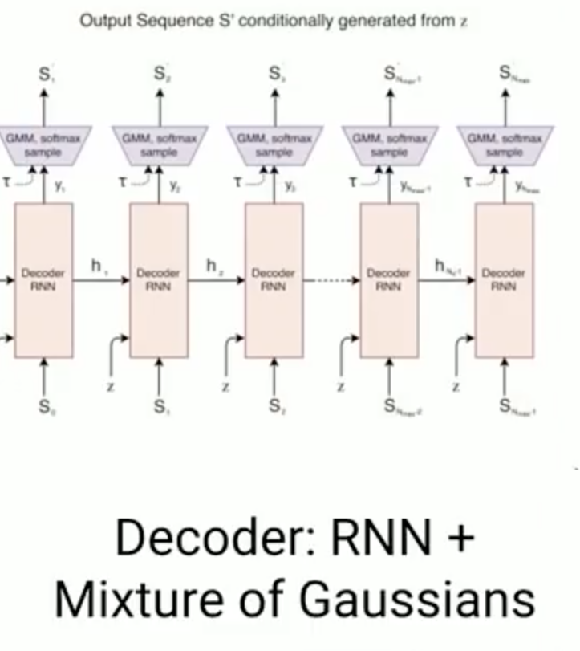

解码器是另一个LSTM网络，同时在网络的每一个输出层添加了一个高斯分布将向量转换成最终的笔画。这和语言翻译的seq2seq模型相同，在解码的过程中，训练和推理会用到不同的输入数据，训练的时候使用真实的解码笔画数据，推理的时候使用上一个LSTM状态。这个在实践中一定会注意到。

#### 输出
输出当然也是一个笔画的时间序列，我们可以看几个例子。

如果我画一个雨点，其他的雨点就会自动产生。
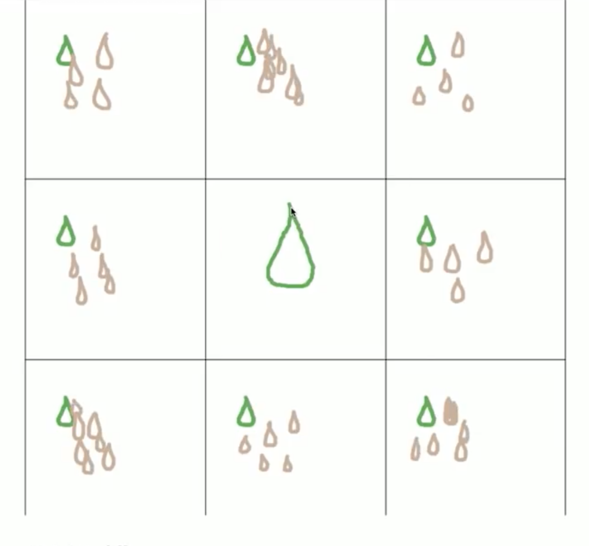
如果我画一条条雨丝，其他的雨丝就会自动产生。
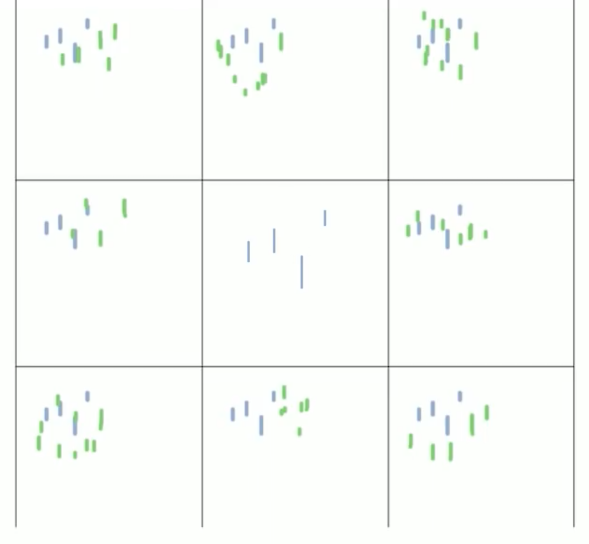
如果我画一朵云，那么云下面就会开始下雨。
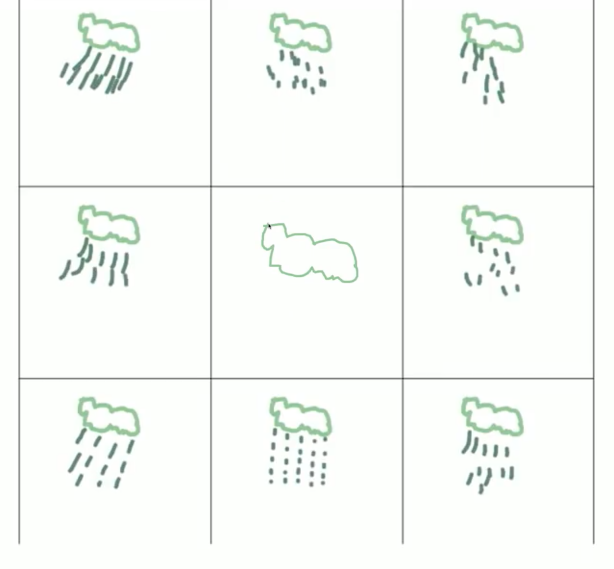
如果我画一艘船，那么船上的其他东西就会自动跑出来。
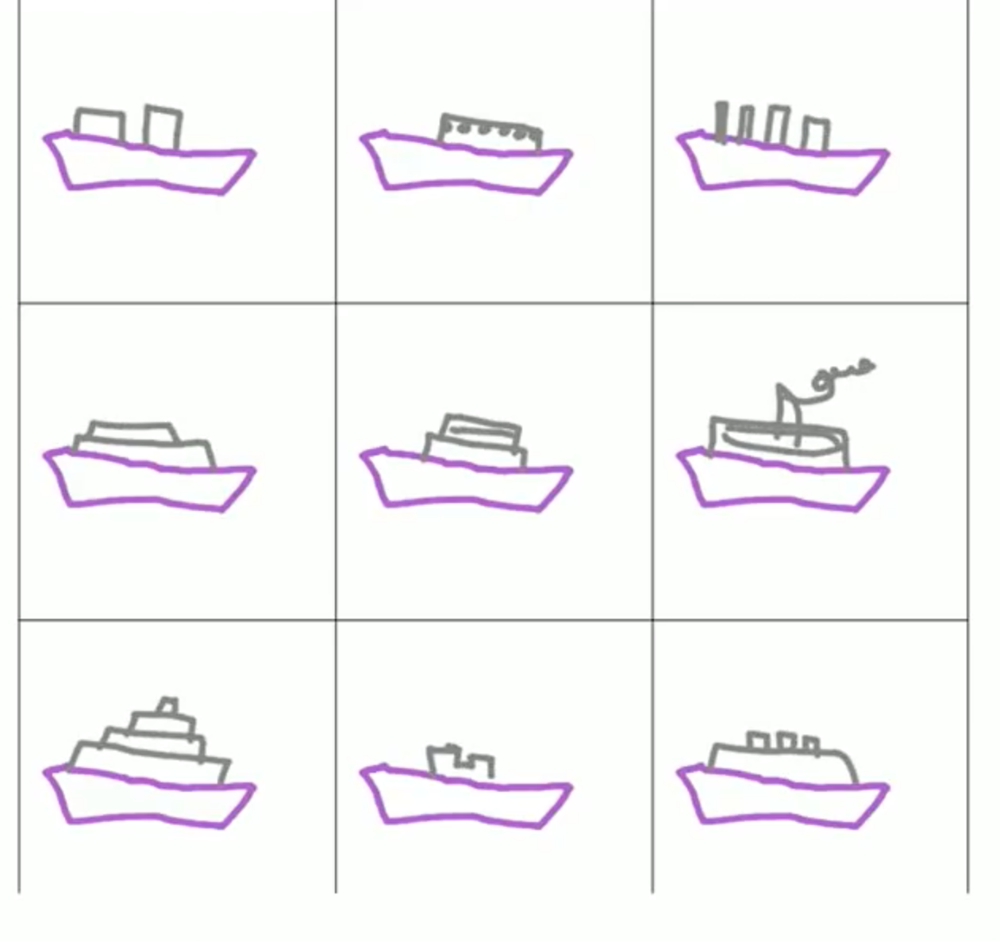
如果我就画两个耳朵，那么圆脸的猫和胡须就会自动出来
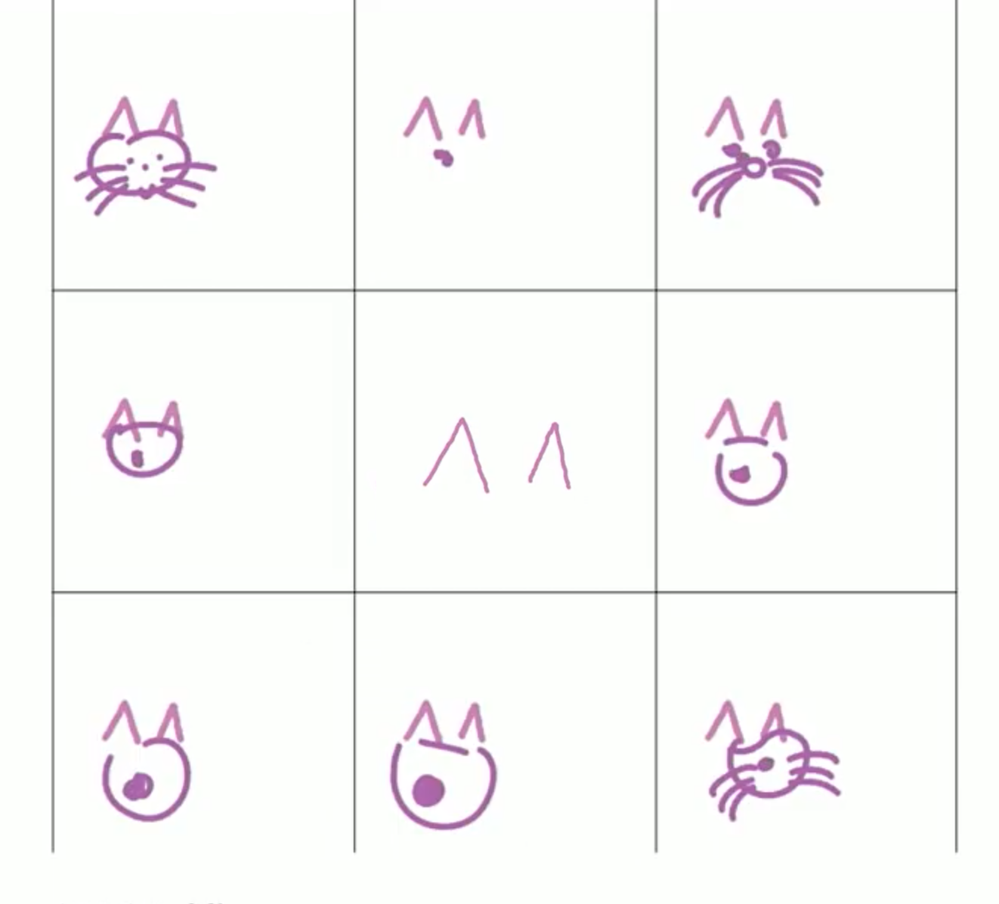

还有很多围绕这个项目的有趣例子。例如可以在中间状态z附近随机抽样几个点，然后看解码器能给出什么结果。例如可以在中间状态进行状态运算，然后看解码器会给出什么。
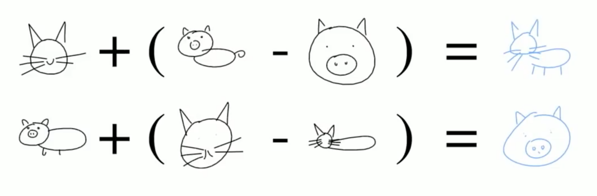