# 如何简单形象又有趣地讲解神经网络是什么？

**题记：“简单” “形象” 两个要求我争取一下。“有趣”的话，我觉得数学挺有趣的，你觉得呢？**

---
神经网络是什么？神经网络就是一系列简单的**节点**，在简单的**拓扑组合**下，表达一个复杂的**函数**。下面我们来一个个解释

### 线性节点
节点是一个简单的函数模型，有输入，有输出。我们

1. 最简单的线性节点: $x + y$

 我能想到的最简单的线性节点当然就是 $x+y$ 了。
 
 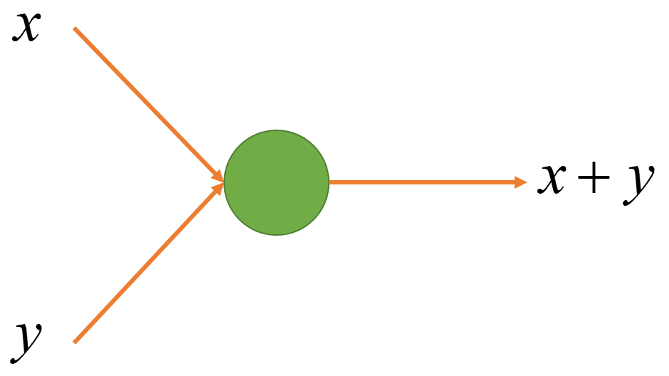
 
2. 参数化线形节点: $ax + by$

 $x + y$ 是一个特殊的线形组合，我们可以一般化所有$x,y$的线性组合, 即 $ax+by$。这里 $a, b$ 就是这个节点的参数。不同的参数可以让节点表示不同的函数，但节点的结构是一样的。
 
 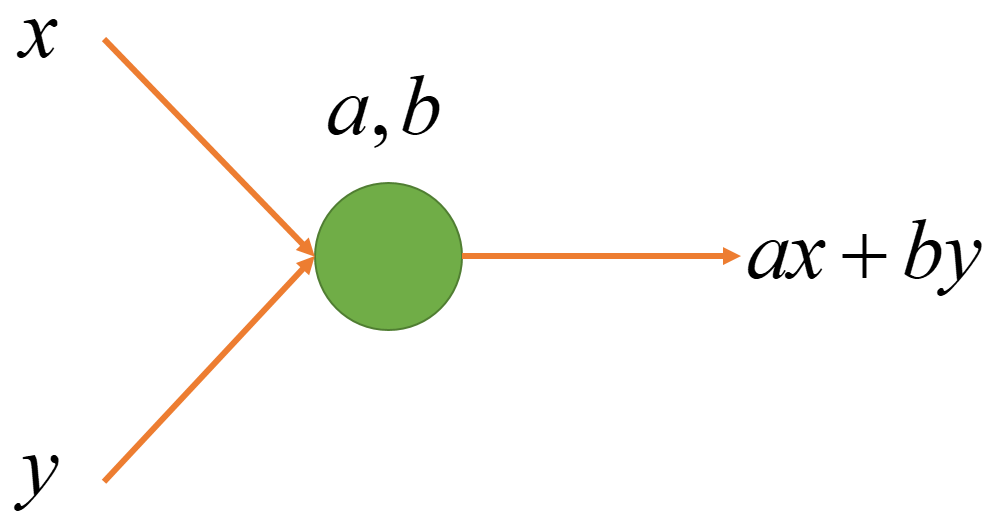
  
3. 多输入线性节点: $a_1x_1 + a_2x_2 + a_3x_3 + ... + a_nx_n$

	我们进一步把 2 个输入一般化成任意多个输入。这里 $a_1, a_2, a_3, ... a_n$ 是这个节点的参数。同样，不同的参数可以让节点表示不同的函数，但节点的结构是一样的。注意 $n$ 并不是这个节点的参数，输入个数不同的节点结构式不一样的。
	
 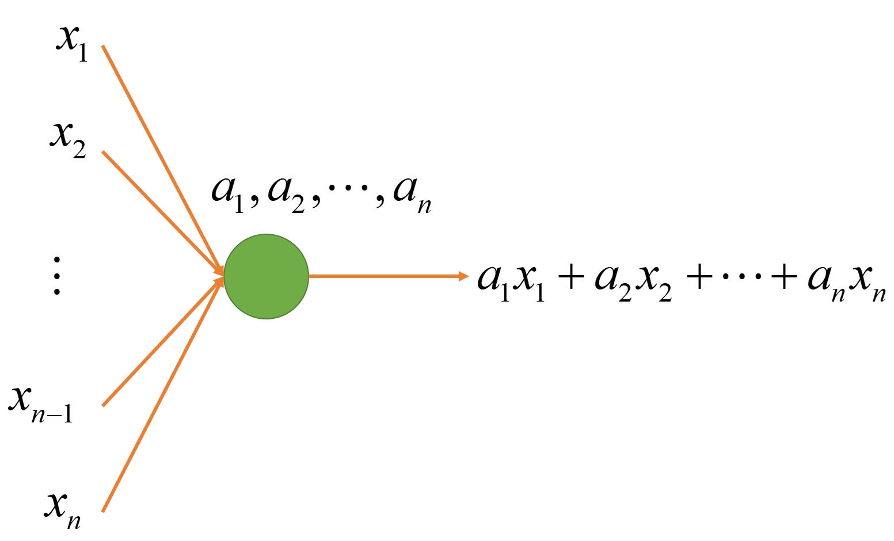
	
4. 线性节点的向量表达: $a^Tx$

 上面的式子太过冗长，我们用向量 $x$ 表示输入向量 $(x_1, x_2, ..., x_n)$，用向量 $a$ 表示参数向量 $(a_1, a_2, ..., a_n)$, 不难证明 $a^Tx = a_1x_1 + a_2x_2 + a_3x_3 + ... + a_nx_n$. 这里向量 $a$ 就是这个节点的参数，这个参数的唯度与输入向量的唯度相同。
 
 

5. 带常量的线性节点: $a^Tx + b$
	
	有时, 我们希望即使输入全部为0的时候，线形节点依然可以有输出，因此引入一个新的参数 $b$ 作为偏差项，以此来增加模型的表达性。有时，为了简化，我们以为会把表达式写作 $a^Tx$。此时，$x=(x_1, x_2,..., x_n, 1), a = (a_1, a_2, ..., a_n, b) $ 
	
 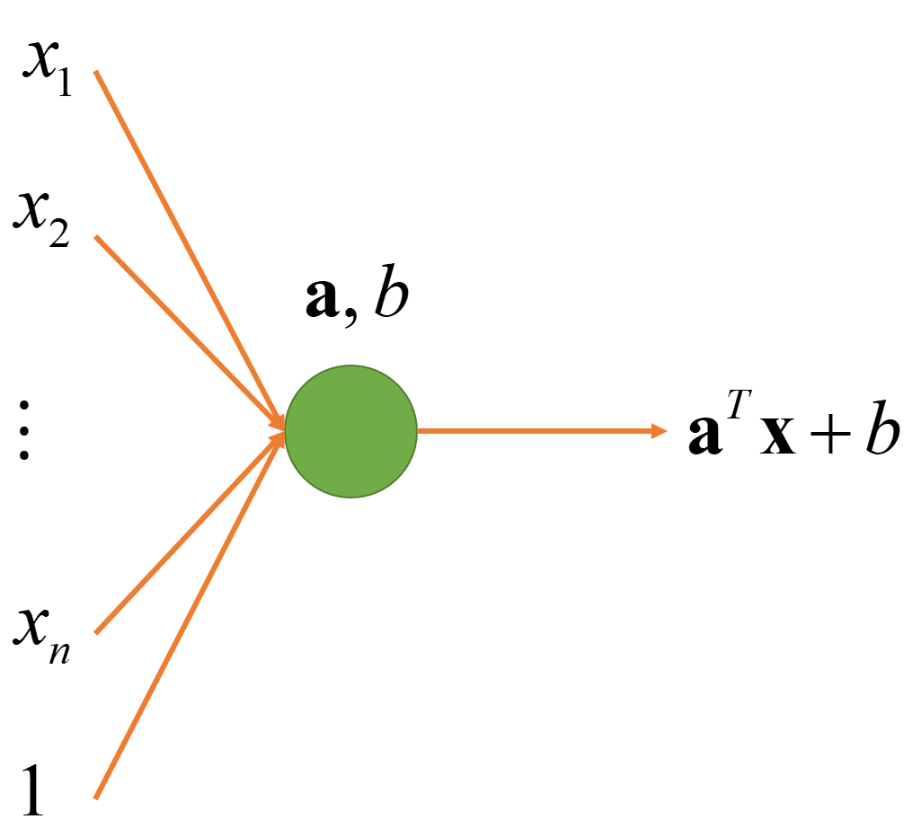
	
6. 带激活函数的线性节点: $\mathbb{1}(a^Tx + b > 0)$

 对于二项分类问题，函数的输出只是真或假，即 0 或 1。函数 $\mathbb{1}: R\rightarrow\{1, 0\}$ 将真命题映射到 1， 将假命题映射到 0。
 
 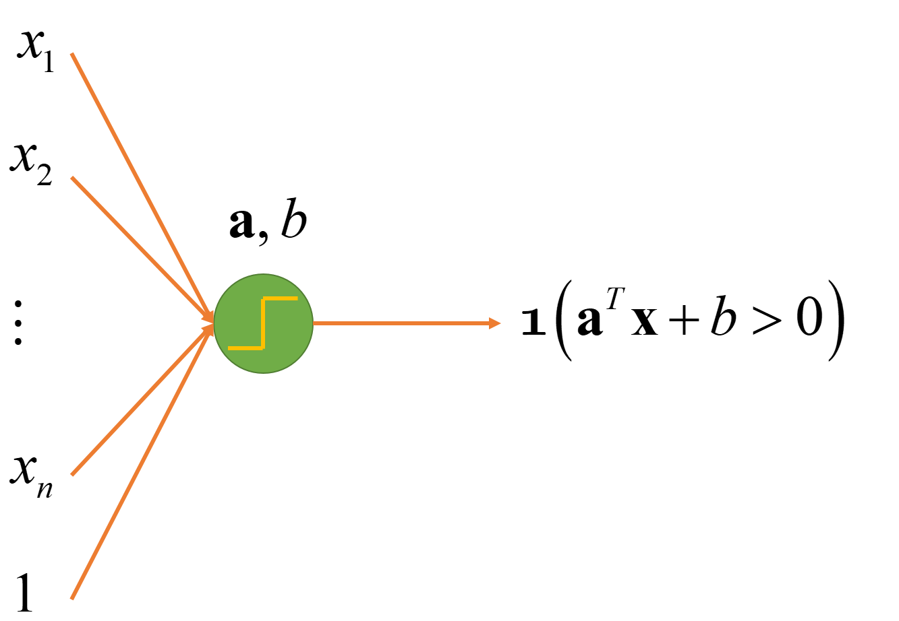
  
### 线性节点实例
1. 用线性节点表达 $x \vee y$（或函数）
 
 或函数的真值表如下:

 | $x$ | $y$ | $x \vee y$ | 
| --- | --- | :---: |
| 0 | 0 | 0 |
| 0 | 1 | 1 |
| 1 | 0 | 1 |
| 1 | 1 | 1 |

 定义节点 $\mathbb{1}(x+y - 0.5>0)$,  不难验证，它与 $x \vee y$ 是等价的。

 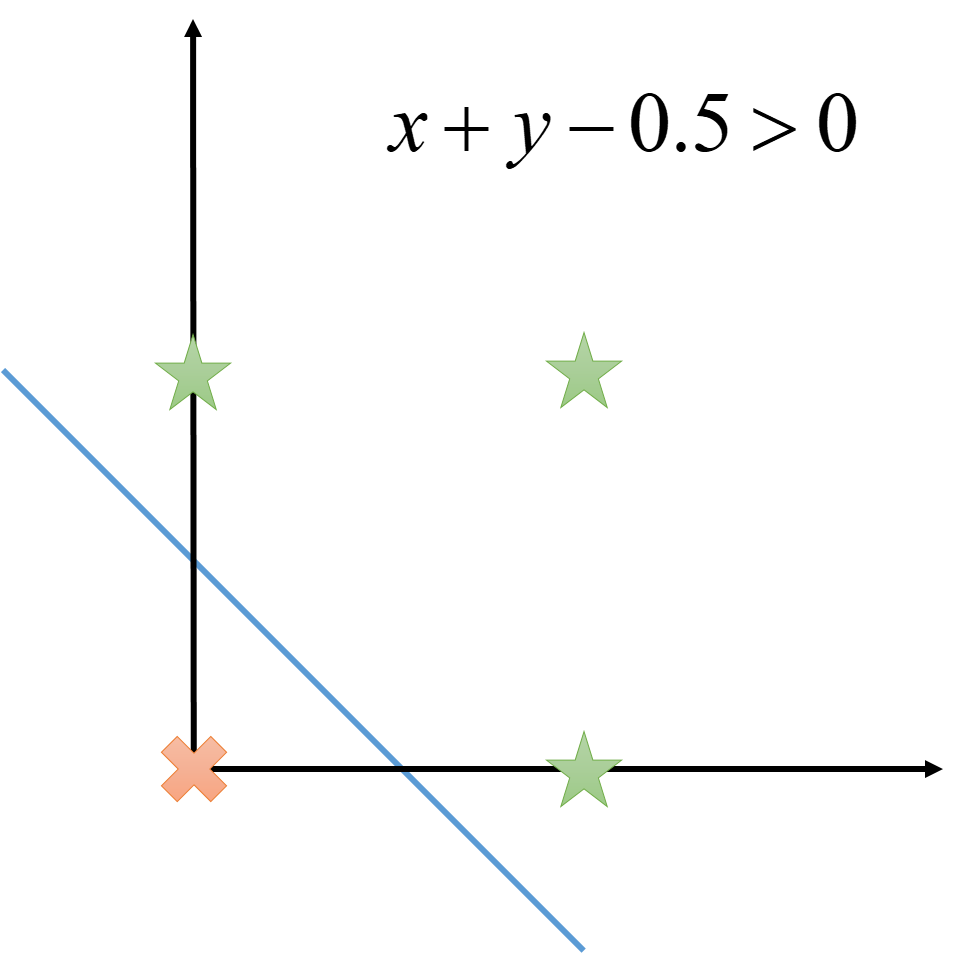
2. 用线性节点表达 $x \wedge y$（与函数） 
 
 与函数的真值表如下:

 | $x$ | $y$ | $x \wedge y$ 
| --- | --- | :---: |
| 0 | 0 | 0 |
| 0 | 1 | 0 |
| 1 | 0 | 0 |
| 1 | 1 | 1 |

 定义节点 $\mathbb{1}(x+y-1.5>0)$, 不难验证，它与 $x \wedge y$ 是等价的。

 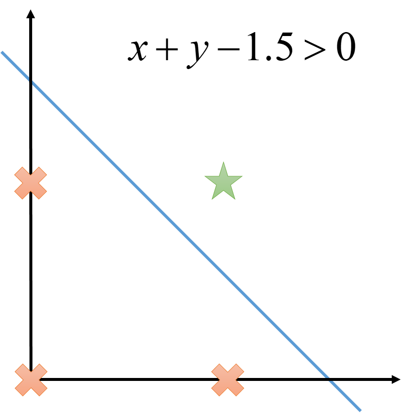

### 线性节点的表达力
单个线性节点可以表达所有线性函数（函数值域为实数集）以及所有线性可分的分类器（函数值域为 $\{0,1\}$）。概念定义和命题的证明我们这里不在阐述。虽然单个线性节点已经很强大，但依然有他的局限性。对于线性不可分的函数，它无能为力，例如异或函数 $x \oplus y$

 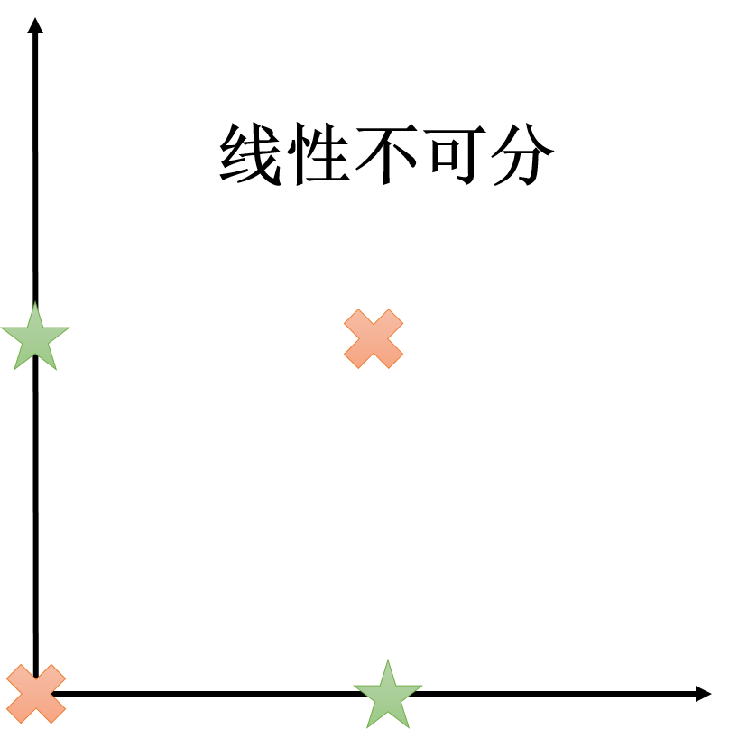

### 线性节点的组合
1. 多个线性节点同层组合: $W^Tx$

	上述的线性节点输入是多维的，但输出只是一维，即一个实数。如果我们想要多维的输出，那么就可以并列放置多个节点。设 $a_1, a_2, ... , a_m$ 分别是 $m$ 个节点的参数，那么输出则分别为 $a_1^Tx, a_2^Tx, ... , a_m^Tx$. 最终的输出结果为
	$$
	\begin{bmatrix}
    a_1^Tx \\
    a_2^Tx \\
    ... \\
    a_m^Tx 
 \end{bmatrix} = 
 \begin{bmatrix}
    a_1^T \\
    a_2^T \\
    ... \\
    a_m^T 
 \end{bmatrix} x = 
 \begin{bmatrix}
    a_1 & a_2 & ... & a_m \\
 \end{bmatrix}^T x = W^Tx
	$$
	其中 $W = [a_1, a_2, ... , a_m]$ 是一个 n 行 m 列的参数矩阵。
 
 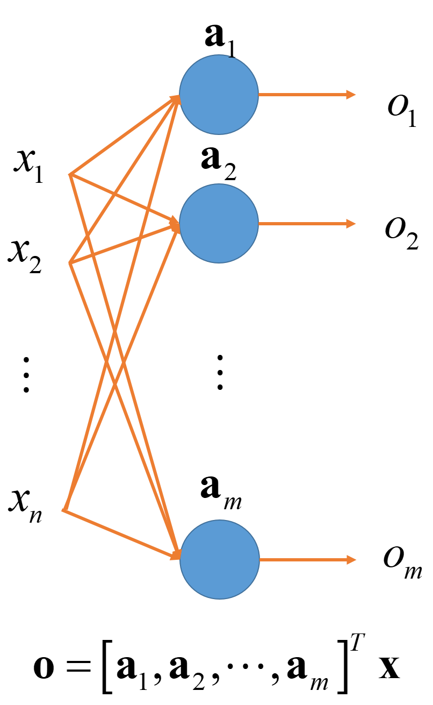
	
 
2. 多层线性节点:
 
	多层线性节点中，某一层带激活函数的线性节点，输出作为下一层的输入。通常中间层（或者隐藏层，图中的蓝色节点）会带有一个激活函数，来增加模型的表达力。（*思考: 如果隐藏层没有激活函数，为什么两层线性节点和一层等价？*）
	
 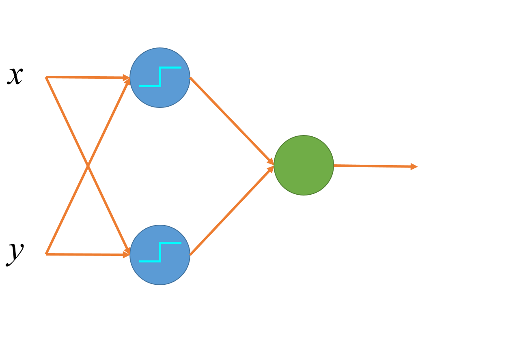

	
### 多层多层线性节点实例

1. 用多层表达异或函数 $x \oplus y$

 异或函数的真值表为：
 
	| $x$ | $y$ | $x \oplus y$ 
| --- | --- | :---: |
| 0 | 0 | 0 |
| 0 | 1 | 1 |
| 1 | 0 | 1 |
| 1 | 1 | 0 |
 
 这是一个不可线性分隔的函数，不可以用一个线性节点表达。但我们可以使用多层的线性节点来完成这个任务。
 
 $h_1 = \mathbb{1}(x+y+0 >0.5)$ 或 $h_1 = x \vee y$
 
 $h_2 = \mathbb{1}(-x-y+2 >0.5)$ 或 $h_2 = \overline{x \wedge y}$
 
 $o = \mathbb{1}(h_1 + h_2 - 1 >0.5)$ 或 $o = h_1 \wedge h_2$ 
 
 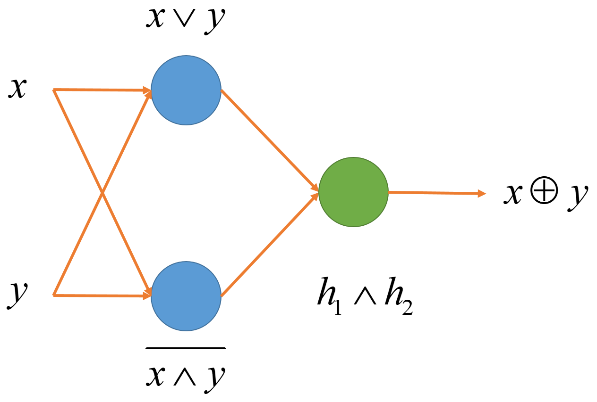

### 多层线性节点的表达力
可以证明，多层神经元可以表达所有连续函数。证明比较复杂，有兴趣的人可以去看一下: [A visual proof that neural nets can compute any function](http://neuralnetworksanddeeplearning.com/chap4.html)

其实我们还有很多常见的节点没有讲到，例如 $ReLu$, $sigmoid$, $dropout$ 等。神经网络不止有正向计算，还有反向传导，这些节点的出现和反向传导息息相关，有机会的话，再来写一篇文章回答 *如何简单形象又有趣地讲解神经网络的反向传导？*

