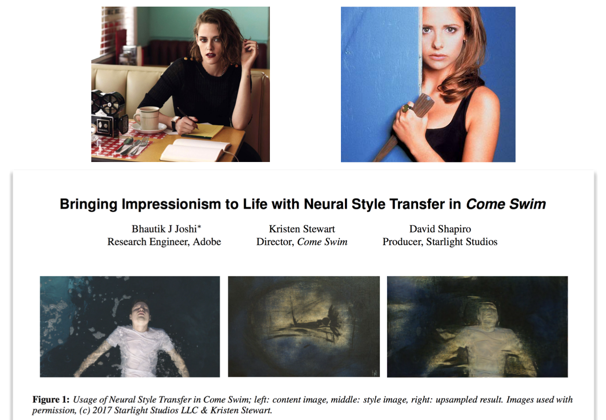
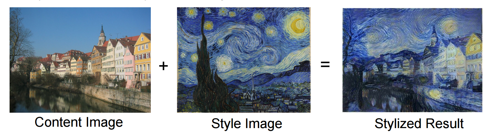
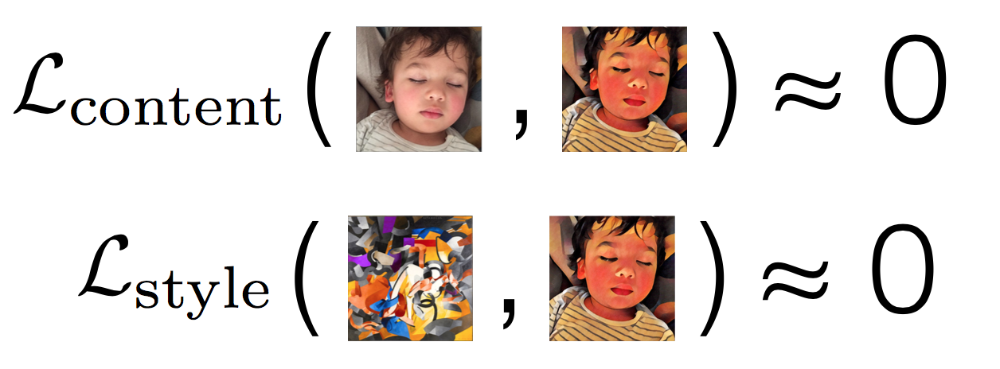
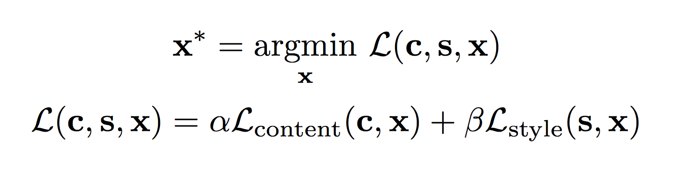
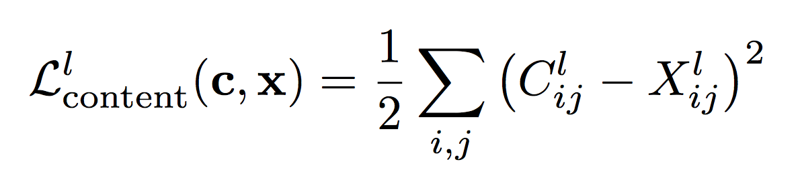
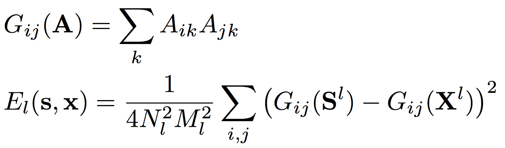
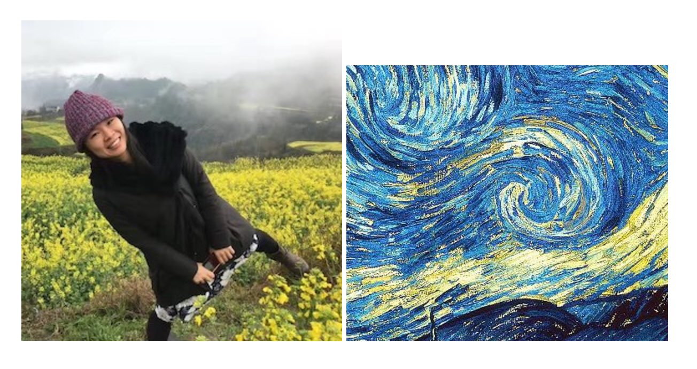
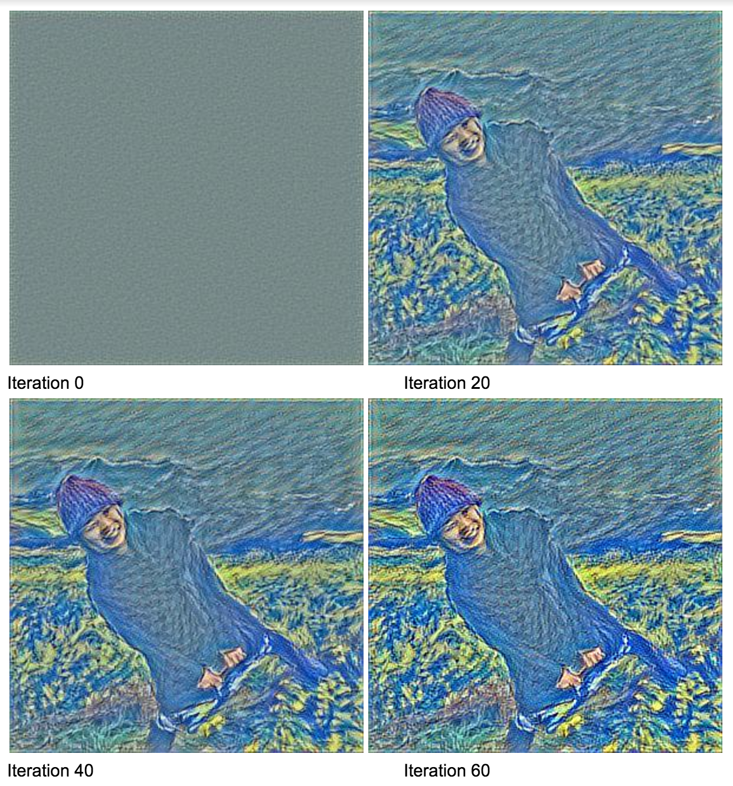
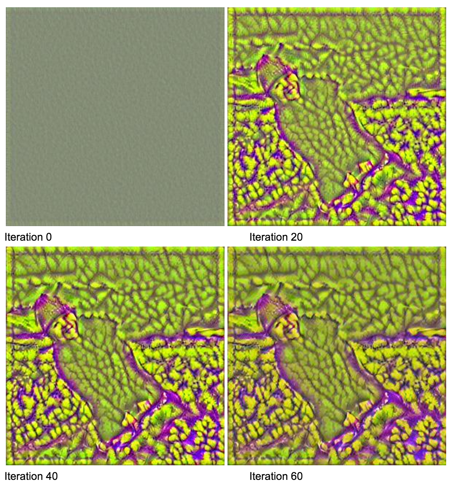

# Prisma 背后的原理

之前看到一篇文章说，困扰Prisma团队最大问题就是 --- 

>我们没有在marketing投入过一分钱，但还是火得太快，我们的服务器承载能力完全跟不上用户的增长。

火得太快，火得太快，火得太快，不得不说，这个装逼我必须给满分！

Prisma 背后的原理其实起源于论文 [Gatys et al, “Image Style Transfer using Convolutional Neural Networks”, CVPR 2016](http://www.cv-foundation.org/openaccess/content_cvpr_2016/papers/Gatys_Image_Style_Transfer_CVPR_2016_paper.pdf)。这篇惊世之作一出，在学术界和工业界刮起来两股热潮。学术界陆续提出融合多种风格的算法，转换视频的算法，一次输出多种风格的算法，等等。工业界则做出网站，应用，小工具让人们给自己的照片加上梵高的风格。可以称得上是所有人的狂欢了。

什么？论文太高大上这辈子都和我没关系？ 女神 Kristen Stewart 你们认不认识？人家拍电影拍着拍着都拍进学术界了，在世界最顶级的计算机图像会议CVPR发了篇 [Bringing Impressionism to Life with Neural Style Transfer in Come Swim](https://arxiv.org/abs/1701.04928)。可见人人都能发CVPR啊，你还不赶紧来学吗？ 



那究竟这篇论文是做什么的呢？ 融合一张图片的内容，和一张图片的风格，生成一张新的图片。



接下来就来详细说说这篇论文的算法原理，再给出一个我的实现，最后再说说学术界后续的一些研究和相关的其他算法。Prisma真实使用的算法应该是在这篇论文的基础上发展过的更高效率的算法，因为这第一篇论文中的算法效率实在不怎么样，当然这丝毫不影响这篇论文的伟大。

### 量化问题

算法的任务很简单，**输入一张内容图片，一张风格图片，输出风格化以后的内容图片。**

- 输入：Content Image，Style Image
- 输出：Stylized Image

>风格化以后的内容图片

这个表达很主观，算法需要一个客观的判断，一个可以量化的标准。这样才有前进的方向。换一个数学一点的表达，我们需要找一个图片，内容上和内容图片差不多，风格上和风格图片差不多。这两个表达我们也需要量化，也就是要有一个数字来衡量**差不多**，所以我们需要有两个函数来分别衡量内容和风格上的差异。



最后我们需要找到图片来同时降低这两个差异。所以风格转化的问题变成了如下的优化问题（Optimization Problem）



其中c代表content image内容图片，s代表style image风格图片，x代表stylized image合成图片。我们要找到使得整体偏差最小的x作为最后的结果。整体偏差就是内容偏差和风格偏差的加权平均。 $\alpha$，$\beta$是两者的权重。希望风格更明显，风格的权重就大一些，希望内容更明显，内容的权重就大一些。

现在，有三个问题放在眼前

1. $\mathcal{L}_{content}$ 如何定义？ 
2. $\mathcal{L}_{style}$ 如何定义？
3. 如何最小化？

我们一个个来搞定
### 卷积神经网络
所有的偏差函数都依赖卷积神经网络，所以必须要来简单介绍一下。时下最流行的深度学习模型就是卷积神经网络了。干嘛的呢？做常见的应用，他是做图片分类的。


我们用神经网络来表达一个函数，输入一张图片，输出各个类的概率。为什么叫神经网络我就不说了，他和人的神经系统其实最多只有半毛钱关系。重要的是，这个神奇的神经网络，分析了输入图片的多种特征。 底层的网络分析了细节特征，例如直线，曲线，三角，方块，等等。高层的网络分析了高层一些的特征，例如鼻子，眼睛，嘴巴等等。

我们来看一下一张汽车图片放到卷积神经网络里面，会是如何的样子？


汽车图片进入网络后，会被在每一层会提取出它拥有的特征，并传递到下一个网络中。深度学习的科学家们很多时间都在研究如何训练这个神经网络使得他的分类能力最准确。幸运的事，我们这个问题我们不用去分类，用不着训练网络，我们只要用现有的已经训练好的网络就好了。我们需要的是每一层的特征，两个偏差函数，都是通过比较每一层的特征计算而得的。我们会使用下图所示的VGG16网络，其中包括13个卷积层，每一层的输出都是我们的所需要的特征。接着我们就会比较这些特征来计算偏差函数


### 计算内容偏差

要比较两个图片的内容差别，其实就看看他们最高层的特征是否一致就行。例如两个图片都有大桥这个特征，两个图片都有一个人等等共同特征，那么我们通常认为他们是一样内容的。



其中c，x代表内容图片和合成图片，$C_{i,j}^l, X_{i,j}^l$ 分别表示内容图片和合成图片的第l层，第i个特征，第j纬度的值。其实式子也没有分复杂，就是计算了两个向量的欧氏距离。

Tensorflow 代码实现

```
def create_content_loss(model, content_image):

	content_layer_names = ['conv3_1/conv3_1'] # we use the toppest layer for content loss 
	layers = model.get_layer_tensors(content_layer_names)
    
	content_dict = model.create_feed_dict(image=content_image)
    content_values = session.run(layers, feed_dict= content_dict)
    
    content_values = tf.constant(value)
    stylized_values = layers #laybers will be evaluated during runtime

    with model.graph.as_default():
        layer_losses = []
    
        for v1, v2 in zip(content_values, stylized_values):
            loss = mean_squared_error(v1, v2)
            layer_losses.append(loss)

        total_loss = tf.reduce_mean(layer_losses)
        
    return total_loss
```
### 计算风格偏差
比较两个图片的风格偏差会稍微复杂一点。如何用数学的式子体现两个内容完全不同的图片，风格一样呢？光光比较他们的特征是不够的，因为一个图里有桥，另一个图里可能没有。因此我们要比较两个图的特征互相之间的关系。这简直是一个天才的想法！我们用Gram Matrix来描述多个特征相互之间的关系，然后来比较两个图的Gram Matrix的距离来衡量风格的相似程度。如果Gram Matrix相近，即特征相互之间的关系相近，那也就说明风格相近。


与内容偏差不同，风格偏差与宏观微观的都有关系，所以我们又算出每一层的风格偏差，再求一个加权平均就好了。


Tensorflow 代码实现

```
def gram_matrix(tensor):
	#gram matrix is just a matrix multiply it's transpose
    
    shape = tensor.get_shape()    
    num_channels = int(shape[3])
    matrix = tf.reshape(tensor, shape=[-1, num_channels])

    gram = tf.matmul(tf.transpose(matrix), matrix)
    return gram 
    

def create_content_loss(model, content_image):

	#we use all 13 conv layers in VGG16 to compute loss function
	content_layer_names = ['conv1_1/conv1_1', 'conv1_2/conv1_2', 'conv2_1/conv2_1', 'conv2_2/conv2_2', 'conv3_1/conv3_1', 'conv3_2/conv3_2', 'conv3_3/conv3_3', 'conv4_1/conv4_1', 'conv4_2/conv4_2', 'conv4_3/conv4_3', 'conv5_1/conv5_1', 'conv5_2/conv5_2', 'conv5_3/conv5_3'] 
    layers = model.get_layer_tensors(content_layer_names)
    gram_layers =gram_matrix(layers)
    
    style_dict = model.create_feed_dict(image=style_image)
    style_values = session.run(gram_layers, feed_dict= style_dict)
    
    style_values = tf.constant(style_values)
    stylized_values = gram_layers #gram_layers will be evaluated during runtime

    with model.graph.as_default():
        layer_losses = []
    
        for v1, v2 in zip(stylized_values, style_values):
            loss = mean_squared_error(v1, v2)
            layer_losses.append(loss)

        total_loss = tf.reduce_mean(layer_losses)
        
    return total_loss
```

### 如何最小化？
对于一个标准的优化问题，梯度下降（Gradient Descent） 一定是可以用的。我们只需要把三张图片全部输入网络，计算出对应的内容偏差(用最后一层)和风格偏差（用每一层），加权平均一下以后获得总偏差，再相对于合成图片求出梯度，用梯度去更新这个图片就可以了。


```
def style_transfer(content_image, style_image,
                   weight_content=1.5, weight_style=10.0,
                   num_iterations=120, step_size=10.0):

    model = vgg16.VGG16() 
	 session = tf.InteractiveSession(graph=model.graph)

    loss_content = create_content_loss(content_image, model)
    loss_style = create_style_loss(style_image, model)   
    loss_combined = weight_content * loss_content + \
                    weight_style * loss_style

    gradient_op = tf.gradients(loss_combined, model.input)
    

    # The mixed-image is initialized with random noise.
    # It is the same size as the content-image.
    #where we first init it
    mixed_image = np.random.rand(*content_image.shape) + 128

    for i in range(num_iterations):
        # Create a feed-dict with the mixed-image.
        mixed_dict = model.create_feed_dict(image= mixed_image)
        
        #compute the gradient with predefined gradient_op
        grad = session.run(gradient_op, feed_dict= mixed_dict)
        grad = np.squeeze(grad)
        step_size_scaled = step_size / (np.std(grad) + 1e-8)

        #update the mixed_image
        mixed_image -= grad * step_size_scaled
        mixed_image = np.clip(mixed_image, 0.0, 255.0)

    session.close()
    
    return mixed_image
```
### 效果如何？
除了稍微慢了一点，效果还是棒棒哒！代码已经提多了，直接上图！

**内容偏差的权重较大时**



**风格偏差的权重较大时**



### 更多的相关研究
Gatyes后续有发表了一些相关的论文，例如下面这个可以保存内容图片的颜色，只在亮度通道中进行风格转化
<br>
[Gatys et al, “Preserving Color in Neural Artistic Style Transfer”, arXiv 2016](https://arxiv.org/abs/1606.05897)

Ruder在视频上进行风格转化，解决了针对不同像素，风格转化不连续的问题
<br>
[Ruder et al, “Artistic style transfer for videos”, arXiv 2016](https://arxiv.org/abs/1604.08610)

在特征空间中使用局部匹配来计算风格偏差，效果比使用Gram Matrix更好
<br>
[Li and Wand, “Combining Markov Random Fields and Convolutional Neural Networks for Image Synthesis”, CVPR 2016](http://www.cv-foundation.org/openaccess/content_cvpr_2016/papers/Li_Combining_Markov_Random_CVPR_2016_paper.pdf)

对于高分辨率图片的快速风格转化
<br>
[Johnson et al, “Perceptual Losses for Real-Time Style Transfer and Super-Resolution”, ECCV 2016](https://arxiv.org/abs/1603.08155)

使用同一个网络同时进行多种风格的转化
<br>
[Dumoulin et al, “A Learned Representation for Artistic Style”, arXiv 2016](https://arxiv.org/abs/1610.07629)

这个话题现在很火，大家去读个几篇，可能就能有自己的想法了！和女神 Kristen 也指日可待了！

### 参考资料
[1] Gatys et al, “Image Style Transfer using Convolutional Neural Networks”, CVPR 2016

[2] Stanford CS 20SI: Tensorflow for Deep Learning Research

[3] Convolutional neural networks for artistic style transfer by Harish Narayanan

[4] How to Do Style Transfer with Tensorflow by Siraj Raval